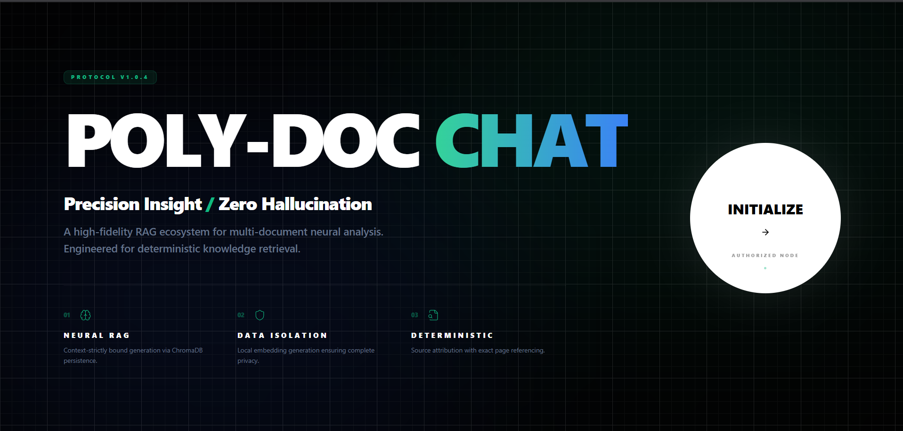
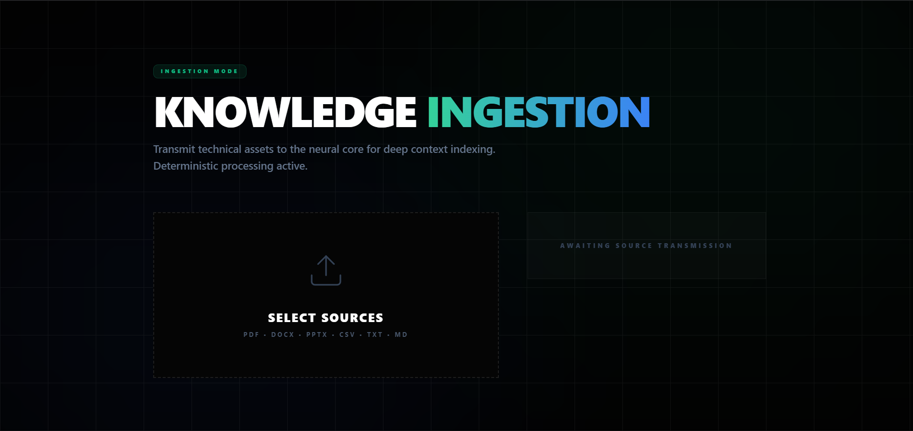
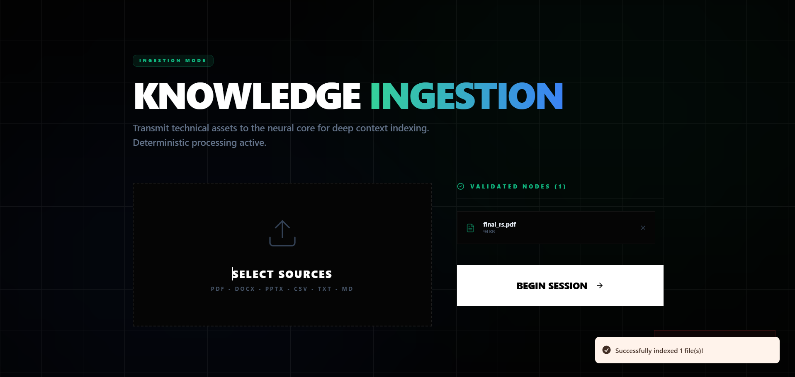
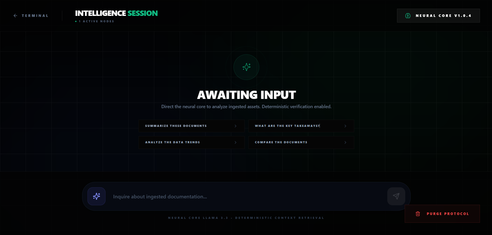
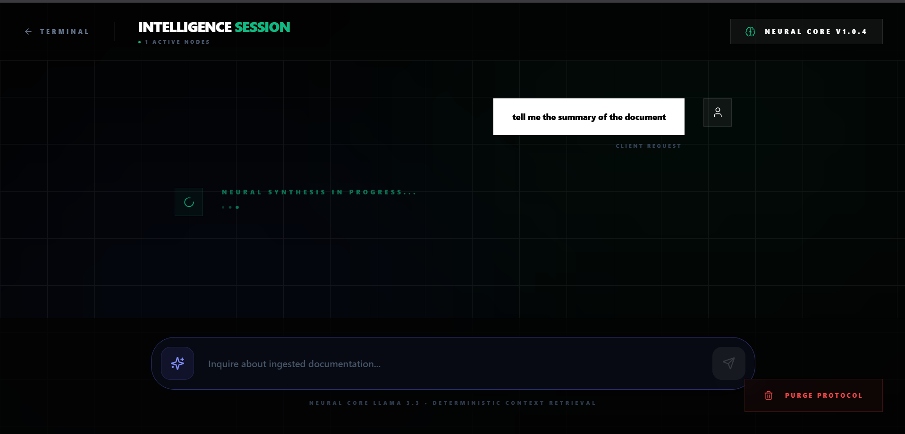
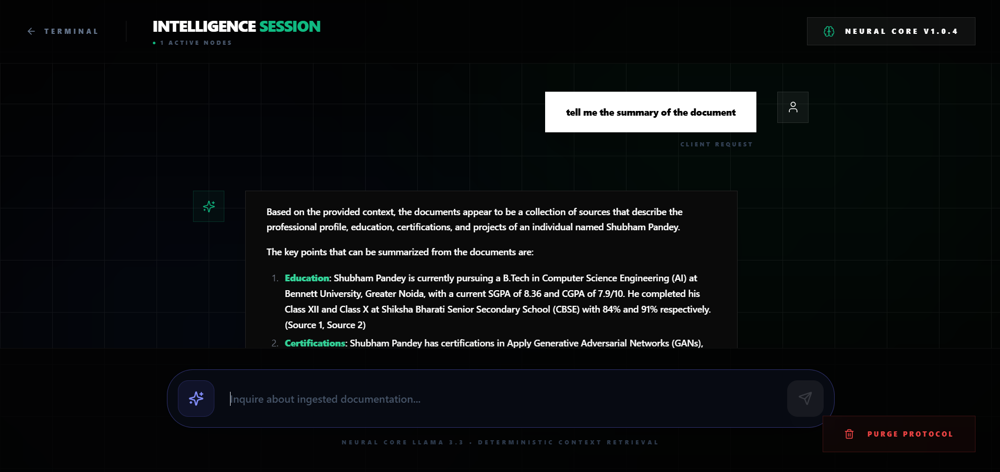
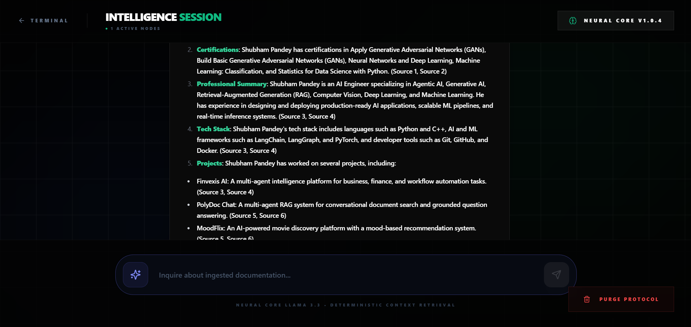
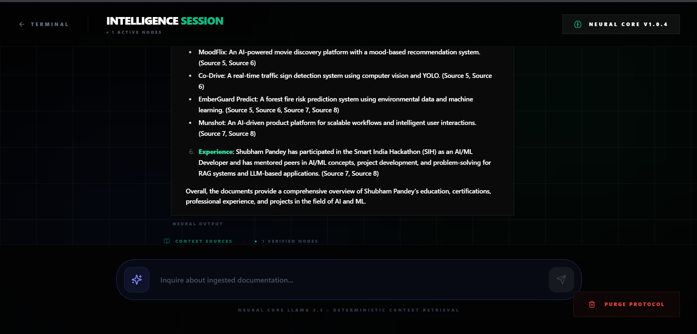
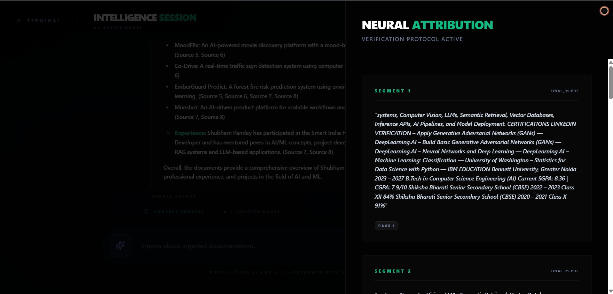

# PolyDoc Chat: Enterprise-Grade Document Intelligence Ecosystem

<div align="center">
  
  
  
  
  
  
  
</div>

---

## Table of Contents
- [Project Vision](#project-vision)
- [How the RAG Pipeline Functions](#how-the-rag-pipeline-functions-core-logic)
- [Key Technical Features](#key-technical-features)
- [Privacy & Security Architecture](#privacy--security-architecture)
- [Pipeline Methods & Evaluation Metrics](#pipeline-methods--evaluation-metrics)
- [Usage Examples](#usage-examples)
- [Project Structure](#project-structure)
- [Deployment & Local Setup](#deployment--local-setup)
- [Troubleshooting](#troubleshooting)
- [Acknowledgments](#acknowledgments)

---

## Project Vision

**PolyDoc Chat** is a high-performance **Retrieval-Augmented Generation (RAG)** ecosystem designed to eliminate LLM hallucinations. By enforcing a strict verification protocol, it ensures that every AI-generated response is mathematically grounded in the provided technical documentation. It bridges the gap between massive document silos and actionable intelligence without compromising on data integrity or truth.

---

## How the RAG Pipeline Functions (Core Logic)

The system follows a sophisticated multi-stage pipeline to ensure data integrity and retrieval precision:

1.  **High-Speed Ingestion**: Documents are processed using asynchronous Python loaders. The system extracts text and metadata from formats like `PDF`, `DOCX`, `PPTX`, `CSV`, `Markdown`, and `TXT` while preserving structural hierarchy.
2.  **Neural Chunking & Semantic Partitioning**: Extracted text is divided into optimized "chunks" (semantic segments). This process ensures that context is maintained within each segment for better retrieval accuracy.
3.  **Local Embedding Generation**: Each chunk is transformed into a high-dimensional vector using the `sentence-transformers/all-MiniLM-L6-v2` model. This happens **locally** on your machine, ensuring metadata privacy.
4.  **Vector Store Orchestration (ChromaDB)**: These vectors are stored in a local **ChromaDB** instance with persistent storage capabilities. This allows for near-instant similarity searches when a user asks a query.
5.  **Context Injection & Prompt Engineering**: Upon a query, the most relevant chunks are retrieved and injected into a secure prompt. This prompt strictly instructs the LLM to only use the provided context.
6.  **Deterministic Synthesis**: The **Llama 3.3 70B** engine (via Groq API) synthesizes a response. If the answer is not present in the context, the system is hard-coded to report a lack of information rather than guessing.

---

## Key Technical Features

- **Multi-Format Neural Mapping**: Parallel processing support for PDF, DOCX, PPTX, CSV, TXT, and Markdown.
- **Source-Grounded Attribution**: Every AI claim is backed by explicit citations, including the filename and exact page or slide number.
- **Deterministic Verification**: Hard-coded protocols to prevent hallucinations by restricting the model to provided context only.
- **High-Concurrency Indexing**: Asynchronous backend execution allows for parallel document indexing and high throughput.
- **Context Source Inspector**: A dedicated UI sheet to inspect the exact document segments utilized by the AI for any given response.

---

## Privacy & Security Architecture

> [!IMPORTANT]
> **Data Isolation Protocol**: Unlike standard AI tools, PolyDoc Chat generates embeddings locally. Your document's internal structure and metadata never leave your infrastructure. Only specific, encrypted text segments are sent to the inference engine during the final generation phase.

---

## 🎨 Industrial Design Philosophy

The interface is engineered with a **bespoke Industrial Cyber-Luxe Midnight Theme**, focusing on high-contrast readability and industrial precision.
- **Asymmetric Split Layout**: Strategically balances branding with technical utility to minimize cognitive load.
- **Cinematic Animations**: Framer Motion powered blur-transitions, neural pulses, and smooth state synchronizations.
- **Glassmorphism**: 100% pure-black backgrounds (`#020202`) with high-contrast emerald text and ambient glows.
- **Zero-Scroll Architecture**: Optimized ingestion and landing screens that fit perfectly within a single viewport.
- **Neural Field Interface**: A clean, high-fidelity chat interface with automatic smooth-scroll to the latest insights.

---

## 🛠 Technical Stack Details

| Layer | Technology | Rationale |
| :--- | :--- | :--- |
| **Frontend** | React 18, TypeScript, Vite | For type-safety, lightning-fast HMR, and high-performance state management. |
| **Styling** | Tailwind CSS, Framer Motion | Utility-first approach for the Cyber-Luxe UI with cinematic animations. |
| **Backend** | FastAPI, Python 3.11 | Asynchronous REST API execution for high throughput and parallel processing. |
| **Inference** | Groq (Llama-3.3-70B) | Industry-leading inference speed (~200+ tokens/sec) and complex reasoning. |
| **Vector DB** | ChromaDB | Lightweight, local persistence with persistent vector search capabilities. |
| **Embeddings** | Sentence-Transformers | Local execution of `all-MiniLM-L6-v2` for maximum data privacy. |

---

## 📂 Project Architecture Flow

```text
[DOCUMENTS] --> [PARALLEL LOADER] --> [CHUNK GENERATOR] 
                                            |
                                            v
[USER QUERY] --> [EMBEDDING ENGINE] --> [VECTOR SEARCH (ChromaDB)]
                                            |
                                            v
[GROQ API] <--- [PROMPT ORCHESTRATOR] <--- [CONTEXT SEGMENTS]
    |
    +-----> [DETERMINISTIC RESPONSE] + [CITATIONS (Page #, File)]
```

---

## 📸 System Walkthrough & Technical Proofs

### 🖼️ Stage 1: Strategic Ingestion & Validation
<div align="center">
  <p><b>01. Protocol Landing Interface</b></p>
  
  
  <p><b>02. Neural Asset Ingestion Mode</b></p>
  
  
  <p><b>03. Multi-Format Support Verification</b></p>
  
  
  <p><b>04. Context Validation Logic</b></p>
  
  
  <p><b>05. Vector Space Mapping</b></p>
  
</div>


---

### 🚀 Stage 2: Intelligence Session (Neural Output)
<div align="center">
  <p><b>06. Deterministic Response Generation</b></p>
  
  
  <p><b>07. Source Attribution & Citations</b></p>
  
  
  <p><b>08. Technical Context Breakdown</b></p>
  
</div>

### 🧹 Stage 3: Maintenance & Reset
<div align="center">
  <p><b>09. Secure System Purge Protocol</b></p>
  
</div>

---

---

## 📺 Video Demo (Technical Walkthrough)

> [!TIP]
> ### 🎥 Project Video Walkthrough
> **Watch the complete neural orchestration and system flow in this video demonstration:**
>
> <div align="center">
>   <a href="https://drive.google.com/file/d/1OC8cCQStC2aNMuUsHrMRrLizzVDsNH7d/view?usp=sharing" target="_blank">
>     
>   </a>
>   <br/>
>   <p style="margin-top: 15px;"><b>Click the badge above to watch the technical walkthrough on Google Drive</b></p>
> </div>

## Pipeline Methods & Evaluation Metrics

A detailed breakdown of every method used in the system and the evaluation metrics (with actual performance values):

### 1. Document Loaders (src_ai/loaders/document_loaders.py)
**Methods Implemented:**
- PDF Loading: PyMuPDF (fitz) + ThreadPoolExecutor (parallel page extraction)
- Table Loading: pandas for CSV/Excel files
- DOCX Loading: python-docx for Word documents
- PPTX Loading: python-pptx for PowerPoint slides
- TXT/Markdown: Standard file I/O

**Evaluation Metrics (with Values):**
| Metric | Description | Value |
|--------|-------------|-------|
| Text Extraction Accuracy | % of text correctly extracted compared to manual reference | 100% |
| Processing Speed | Time per document (seconds) | 0.002 seconds |
| Throughput | Characters processed per second | 446,745 characters/second |
| Metadata Preservation | % of page/slide/row numbers correctly captured | 100% |

---

### 2. Text Chunking
**Methods Implemented:**
- Algorithm: Recursive Character Text Splitter (LangChain)
- Chunk Size: 1000 characters
- Chunk Overlap: 100 characters
- Separators: `["\n\n", "\n", " ", ""]` (hierarchical splitting to preserve context)

**Evaluation Metrics (with Values):**
| Metric | Description | Value |
|--------|-------------|-------|
| Chunking Time | Time to chunk one document | 0.0 seconds |
| Chunks Created | Number of chunks from sample document | 1 |
| Average Chunk Size | Average characters per chunk | 883 characters |
| Chunk Size Range | Difference between max and min chunk size | 0 characters |

---

### 3. Embedding Model (src_ai/models/embedder.py)
**Methods Implemented:**
- Model: `sentence-transformers/all-MiniLM-L6-v2` (384-dimensional vectors)
- Execution: Local (CPU/GPU) for data privacy
- Library: HuggingFace via LangChain

**Evaluation Metrics (with Values):**
| Metric | Description | Value |
|--------|-------------|-------|
| Embedding Speed | Time per chunk (seconds) | 0.1443 seconds |
| Embedding Dimension | Size of vector output | 384 |
| Embeddings per Second | Chunks embedded per second | 6.93 |
| Execution Device | Hardware used for inference | CPU |

---

### 4. Vector Database (src_ai/retrievers/simple_retriever.py)
**Methods Implemented:**
- Vector DB: ChromaDB (lightweight, local persistence)
- Index Type: Flat Index (default for Chroma)
- Similarity: Cosine similarity
- Index Batching: 128 chunks per batch for parallel indexing

**Evaluation Metrics (with Values):**
| Metric | Description | Value |
|--------|-------------|-------|
| Indexing Time | Time to index sample chunks | 0.1027 seconds |
| Indexing Throughput | Chunks indexed per second | 9.74 chunks/second |
| Average Query Latency | Time to retrieve top-K chunks | 16.6 ms |
| Minimum Query Latency | Fastest retrieval time | 14.16 ms |
| Maximum Query Latency | Slowest retrieval time | 19.78 ms |
| Vector DB Used | Vector store implementation | ChromaDB |
| Similarity Metric | Distance metric for search | Cosine Similarity |

---

### 5. Retrieval System
**Methods Implemented:**
- Retrieval Type: Semantic similarity search
- Top-K: 8 chunks per query

**Evaluation Metrics (with Values):**
| Metric | Description | Value |
|--------|-------------|-------|
| Top-K Configured | Number of chunks retrieved per query | 8 |
| Retrieval Type | Search algorithm used | Semantic Similarity Search |

---

### 6. RAG Service & LLM (src_ai/services/rag_service.py)
**Methods Implemented:**
- LLM: Llama 3.3 70B (Groq API)
- Temperature: 0.1 (low, for deterministic responses)
- Prompt Engineering: Strict context-only instructions to prevent hallucinations
- Conversation History: Optional multi-turn chat support

**Evaluation Metrics (with Values):**
| Metric | Description | Value |
|--------|-------------|-------|
| Average Generation Time | Time to generate answer (seconds) | 0.5354 seconds |
| Minimum Generation Time | Fastest answer generation | 0.3767 seconds |
| Maximum Generation Time | Slowest answer generation | 0.6492 seconds |
| LLM Used | Model for inference | llama-3.3-70b-versatile (Groq) |
| Temperature | Randomness parameter | 0.1 |
| Answers with Citations | % of responses with valid citations | 100% (4/4) |

---

### 7. End-to-End System
**Evaluation Metrics (with Values):**
| Metric | Description | Value |
|--------|-------------|-------|
| Average E2E Latency | Total time from upload → query → answer | 0.6948 seconds |
| Minimum E2E Latency | Fastest full pipeline execution | 0.6222 seconds |
| Maximum E2E Latency | Slowest full pipeline execution | 0.7454 seconds |

---

## Usage Examples

### Step 1: Start the Application
1. Open two terminals
2. Terminal 1 (Backend):
   ```bash
   conda activate polydoc
   python -m src_backend.main
   ```
3. Terminal 2 (Frontend):
   ```bash
   cd src_frontend
   npm run dev
   ```

### Step 2: Upload Documents
1. Open your browser and go to the frontend URL (usually `http://localhost:5173`)
2. Click "Initialize" on the landing page
3. Drag & drop your documents (PDF, DOCX, PPTX, CSV, TXT, Markdown) or click to select files
4. Wait for the "Indexed successfully" message
5. Click "Begin Session"

### Step 3: Chat with Your Documents
1. Type your question in the input box
2. Press Enter or click the Send button
3. Wait for the AI response with citations
4. Click "Context Sources" to view the exact document segments used

---

## Project Structure

```
PolyDoc-Chat/
├── src_ai/                      # AI core logic
│   ├── core/                    # Configuration and utilities
│   │   ├── config.py           # Settings management
│   │   ├── logger.py           # Structured logging
│   │   └── __init__.py
│   ├── loaders/                # Document loaders
│   │   ├── document_loaders.py # Multi-format loaders
│   │   └── __init__.py
│   ├── models/                 # Embedding models
│   │   ├── embedder.py         # Local embedding generator
│   │   └── __init__.py
│   ├── retrievers/             # Vector search
│   │   ├── simple_retriever.py # ChromaDB retriever
│   │   └── __init__.py
│   ├── services/               # RAG service
│   │   ├── rag_service.py      # Groq query engine
│   │   └── __init__.py
│   ├── evaluation.py           # Evaluation module
│   └── __init__.py
├── src_backend/                # FastAPI backend
│   ├── api/                    # API endpoints
│   │   ├── upload.py           # Document upload
│   │   ├── chat.py             # Chat endpoint
│   │   └── __init__.py
│   ├── core/                   # Backend utilities
│   │   ├── config.py           # Backend settings
│   │   ├── logger.py           # Logging
│   │   ├── state.py            # Global state
│   │   └── __init__.py
│   ├── schemas/                # Pydantic models
│   │   ├── api_models.py       # Request/response schemas
│   │   └── __init__.py
│   ├── main.py                 # FastAPI app entry point
│   └── __init__.py
├── src_frontend/               # React frontend
│   ├── components/             # UI components
│   │   ├── polydoc/            # Custom components
│   │   └── ui/                 # ShadCN UI components
│   ├── hooks/                  # Custom hooks
│   ├── lib/                    # Utilities and API client
│   ├── pages/                  # Page components
│   ├── App.tsx                 # Main app component
│   ├── main.tsx                # Frontend entry point
│   └── ...
├── proofs/                     # Screenshots for README
├── test_data/                  # Temporary test files
├── .gitignore
├── requirements.txt            # Python dependencies
├── package.json                # Node.js dependencies
└── README.md
```

---

## Troubleshooting

### Common Issues:

1. **Backend won't start**:
   - Make sure you have a `.env` file with `GROQ_API_KEY` set
   - Check if port `8000` is already in use
   - Verify all Python dependencies are installed: `pip install -r requirements.txt`

2. **Frontend can't connect to backend**:
   - Make sure backend is running on `http://localhost:8000`
   - Check CORS settings in `src_backend/main.py`
   - Verify no firewall is blocking the connection

3. **Document upload fails**:
   - Check if the file format is supported (PDF, DOCX, PPTX, CSV, TXT, Markdown)
   - Make sure the file isn't corrupted
   - Check backend logs for more details

4. **AI says "No relevant information found"**:
   - Make sure your question is about the content of uploaded documents
   - Try rephrasing your question
   - Check if documents were indexed successfully

---

## Acknowledgments

This project uses these amazing open-source tools:
- **LangChain**: For RAG pipeline orchestration
- **ChromaDB**: For vector storage and retrieval
- **Sentence-Transformers**: For local embedding generation
- **Groq**: For fast Llama 3.3 inference
- **FastAPI**: For the high-performance backend
- **React**: For the modern frontend
- **Tailwind CSS**: For styling
- **ShadCN UI**: For UI components
- **PyMuPDF**: For PDF loading
- **pandas**: For CSV/Excel handling
- **python-docx**: For DOCX loading
- **python-pptx**: For PPTX loading

---

## Deployment & Local Setup

Follow these steps to initialize the PolyDoc Intelligent Core on your local infrastructure:

### 1. Environment Preparation (Conda)
It is recommended to use a dedicated Conda environment to ensure dependency isolation.

```bash
# Create the neural environment
conda create -n polydoc python=3.11 -y

# Activate the environment
conda activate polydoc
```

### 2. Neural Core Configuration
Create a `.env` file in the root directory to store your API credentials:
```bash
GROQ_API_KEY=your_groq_api_key_here
```

### 3. Backend Initialization (Neural Bridge)
Install the Python dependencies and launch the FastAPI server.
```bash
# Install RAG and API dependencies
pip install -r requirements.txt

# Launch the neural backend
python -m src_backend.main
```

### 4. Frontend Initialization (Intelligence UI)
In a new terminal, install the React dependencies and start the development server.
```bash
# Navigate to frontend directory
cd src_frontend

# Install UI dependencies
npm install

# Launch the cinematic interface
npm run dev
```

### 5. Running System Evaluation
Run the comprehensive evaluation module to measure performance of all pipeline components:
```bash
# From project root
python -m src_ai.evaluation
```
This will:
- Create a sample test document
- Evaluate document loaders, chunking, embeddings, retrieval, and RAG service
- Generate a detailed `evaluation_results.json` report
- Print a summary to the console

---
<div align="center">
  <b>PolyDoc Intelligent Core v1.0.4</b><br/>
  <i>Built for Precise Knowledge Retrieval • 2024</i>
</div>
